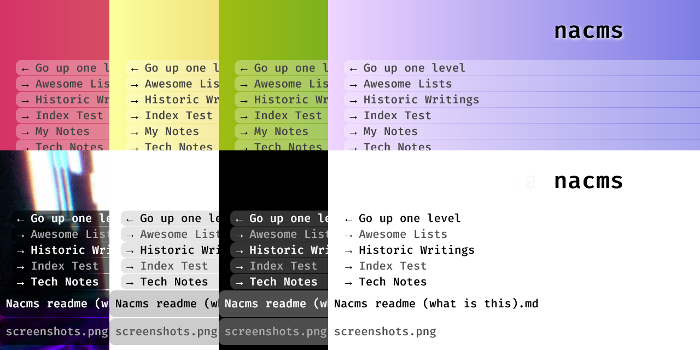

# Nacms

Nacms is what I call the two scripts that are a way of navigating portable files without using any sort of CMS or writing HTML files to link them together. It can be used for a public of client facing folder list. Nacms has two parts:

1. **The index replacement** is a script that displays the contents of a folder that do not have any index files and allow indexes to be shown. It's very simple but effective.
2. **The markdown viewer** is a script that displays the contents of a markdown file in a robust and (I hope) mobile responsive way. This way raw markdown file can sit next to HTML files and other content such as zip archieves.

By editing the .htaccess file of any folder, including the root subdomain folder or root domain folder, you will be able to navigate all sub folders in a straight forward way. However, it will be slightly prettier than the default folder list and will not show the file sizes. (I could add file sizes as an option, I suppose. I just didn't want it for my archive viewing purpose of Nacms.)

When I got the idea to use file handlers in the `.htaccess` and to combine that
with a folder listing I found Sam Minnée's
[Markdown Handler](https://github.com/sminnee/markdown-handler) and stole
several concepts and code segments from that project.

It also uses Parsedown to generate the HTML.

## Uses

* To navigate folders on a public or clients facing website
* To list files for download
* Allow users to select files to view, including:
    * Markdown files
    * Text files
    * HTML files (which load like normal)
    * Image files (which load like normal)

Unlike other folder listing scripts, this is not designed to highlight filetypes and files sizes.

## Features

* Shows folder listings
    * Is clean and simple
    * Shows folder name as title
    * Doesn't show dates of file sizes
    * Doesn't list folder or files prefixed with a period (.)
    * Doesn't list common webserver files or folders
    * Uses the clean but techie looking Fire Code font for file names
    * Works with spaces in folder names
    * A few mediocre themes you can choose from, 2 of them are animated.
* Shows text and markdown files in a clean, readable way
    * Outputs as HTML
    * Uses an ideal reading width of 50-70 characters per line
    * Uses the clean sans serif Poppins font
    * Works with special characters in file names including spaces and apostrophes
    * Can display files that contain HTML segments that are not part of a proper or valid HTML document

### Why Markdown? (Skip this)

I wanted to store some fun documents that I wrote or that are from history in to a personal archieve. The most portal document format in the world is a plain text file. But those don't look nice and can lose important formatting. HTML is the next most portal file format. The problem with HTML is that the styles used in it are locked in. Also, viewing raw HTML can be challenging for novice users and editing text in such a document increases one's cognitive load and make grammer mistakes easy to miss.

For these reason I've come to like markdown. markdown can be easily process in to any richtext document like HTML, but is easy to read in it's raw form. Where more complex stuff is required, HTML is valid. But unlike an HTML document, it doesn't need to be a completely HTML file with `<html>`, `<title>`, and `<body>` elements.

In sum, markdown is a plain text file that can be understood by novice users but can be parsed as rich text and quickly shown as HTML that looks nice when basic CSS is applied to it. So in a decade you can still open the files or run it through a different processes and not have to reformat them as an HTML files or strip out HTML to feed it in to another format. Including converting it to rich text first using any of the online tools that do just that.

One drawback is that there are several markdown formats and so if you do something really stra

## Installation

Because the css needs to be publicly accessisble the Nacms folder should be
in your document path (public folder) such as `public_html/`. I recommend
renaming the folder to `.nacms` and putting it in the folder where you want
Nacms to function, but it can be in any public folder.

Rename the htaccess file to `.htaccess` and copy it to the folder where you want
the Nacms function. It will apply to that folder and all subfolders. Edit the file to change the path to the `.nacms` folder.

Note: Comment out with a hash symbol `#` for any options you don't want.

This seems to work with a basic Apache server on a shared hosting server.

Now any `.md` markdown file will render as proper HTML. Edit
`folder-handler.php` and uncomment a theme if you would like to use it. Rainbow and Cyberpunk are animated if you like things being over the top or garish.

### Additional install info

* You can update `httpd.conf` with the `htaccess` files instead.

* Ensure that `mod_rewrite` and `mod_actions` are enabled in your Apache server:
    - `sudo a2enmod rewrite`
    - `sudo a2enmod actions`
    - `sudo systemctl restart apache2` (apply the changes)

## TODO

* Consider other markdown parsers
    * Footnotes, anchor links, etc.
* Add option for the viewer (markdown handler) to show a header or footer that bring you back to the index.
* Add some way of listing file descriptions, like an file_id.diz or .nfo
* Meta data for files so the viewer can be smarter, or is that going too far?
* Make a way to download raw markdown files?
* Make options in folder view, like files sizes?
